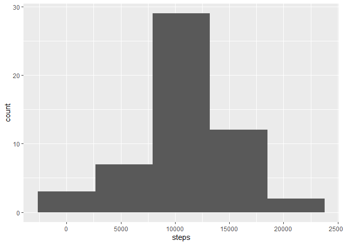
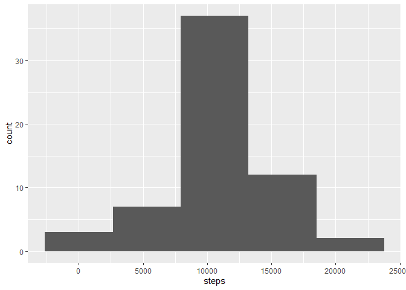
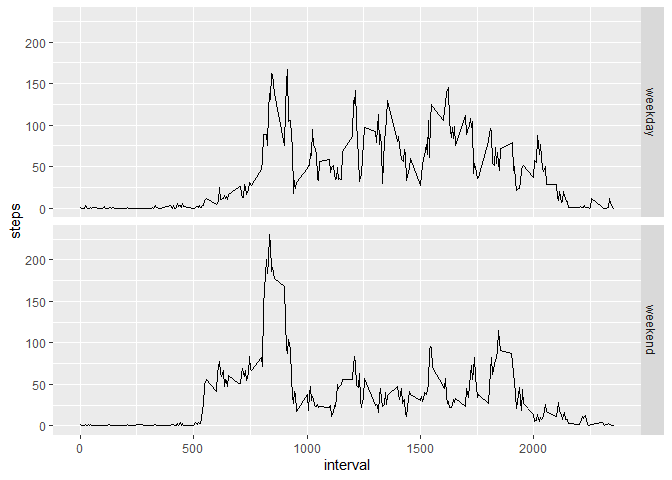

## Loading and preprocessing the data


```r
  activity <- read.csv("activity.csv")
  activity_clean <- activity %>% drop_na()
```

## What is mean total number of steps taken per day?


```r
  activity_date <- activity_clean %>% group_by(date) %>% summarise_at("steps", sum)

  g1 <- ggplot(activity_date, aes(x = steps)) + geom_histogram(bins = 5)
  g1
```

<!-- -->

```r
  mean_steps <- mean(activity_date$steps)
  mean_steps
```

```
## [1] 10766.19
```

```r
  median_steps <- median(activity_date$steps)
  median_steps
```

```
## [1] 10765
```

This individual took, on average, 10,766.19 steps every day day. The median number of steps per day was 10,765.

## What is the average daily activity pattern?


```r
  activity_interval <- activity_clean %>% group_by(interval) %>% summarise_at("steps", mean)
  g2 <- ggplot(activity_interval, aes(x = interval, y = steps)) + geom_line()
  g2
```

<!-- -->

```r
  max_interval <- activity_interval %>% filter(steps == max(steps)) %>% pull(interval)
  max_interval
```

```
## [1] 835
```
The interval with the highest average step count is the interval starting at minute 835.

## Imputing missing values

```r
  impute.mean <- function(x) replace(x, is.na(x), mean(x, na.rm = TRUE))
  activity_impute <- activity %>% group_by(interval) %>% mutate(steps=impute.mean(steps)) %>% ungroup()
  activity_impute_date <- activity_impute %>% group_by(date) %>% summarise_at("steps", sum)
  
  g3 <- ggplot(activity_impute_date, aes(x = steps)) + geom_histogram(bins = 5)
  g3
```

<!-- -->

```r
  mean_impute_steps <- mean(activity_impute_date$steps)
  mean_impute_steps
```

```
## [1] 10766.19
```

```r
  median_impute_steps <- median(activity_impute_date$steps)
  median_impute_steps
```

```
## [1] 10766.19
```
Because we replaced NA values with the mean for the interval across all days, the mean total step count per day was unaffected and remained 10,766.19. However, the median was pulled towards the mean and the reduced to 10,766.19. If we had used the median per interval, the opposite would have happened. Note also that the median is no longer a Natural Number.

While the location of the histogram remained identical, its spread was reduced considerable. By replace NA values with the mean, we have artificially reduced the variance of the distribution.

## Are there differences in activity patterns between weekdays and weekends?


```r
  activity_impute_day <- activity_impute %>% mutate(daytype = factor(is.weekend(date), levels=c(TRUE, FALSE), labels=c("weekday", "weekend"))) %>% group_by(interval, daytype) %>% summarise_at("steps", mean)

  g4 <- ggplot(activity_impute_day, aes(x = interval, y = steps)) + geom_line() + facet_grid(rows = vars(daytype))
  g4
```

<!-- -->

There is a spike around the 750 minute mark during weekend. The step count also remains 0 for longer which suggests a late start to the day on weekends.
